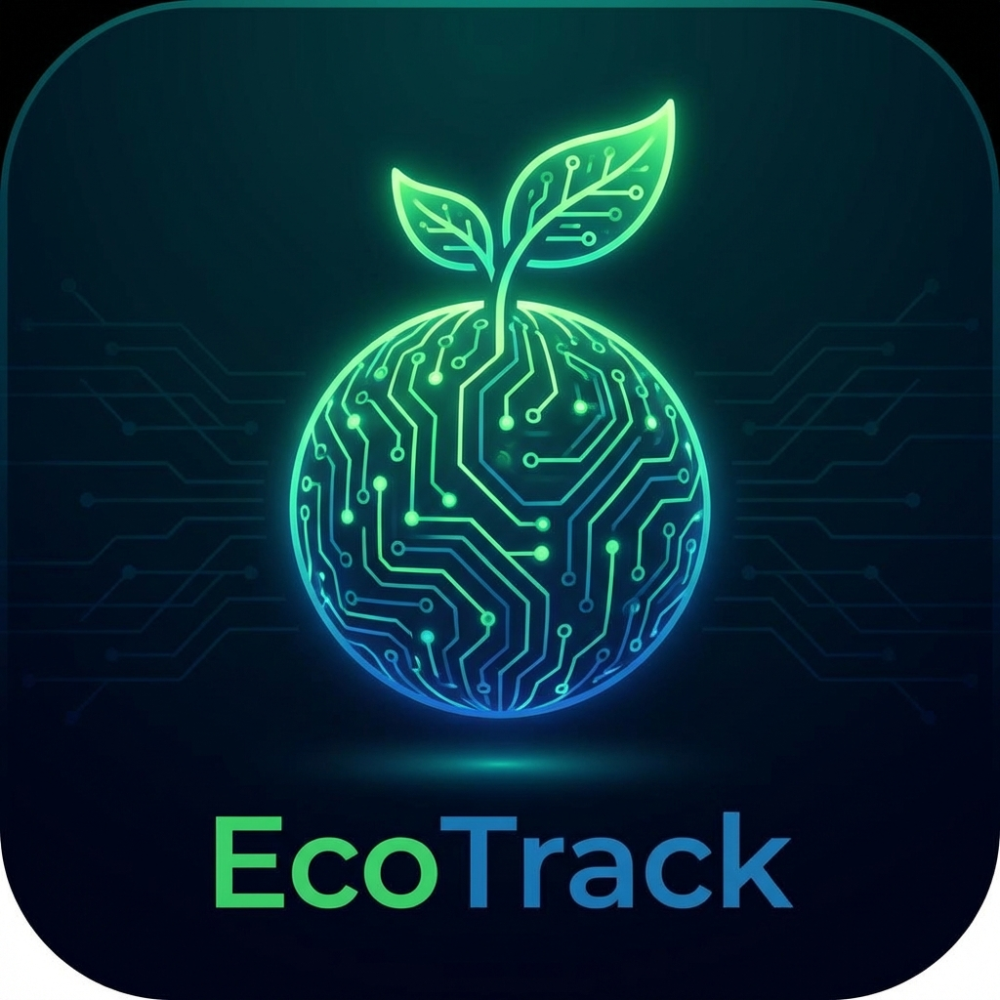

# EcoTrack - Sustainable Living Tracker 🌱


[](https://opensource.org/licenses/MIT)

**EcoTrack** is a modern web application designed to empower individuals to calculate, track, and reduce their carbon footprint. By integrating AI-powered recommendations (Groq/Llama), gamified challenges, and local business discovery, EcoTrack makes sustainability accessible and engaging.

<div align="center">
  
</div>

---

## 🌟 Key Features

### 1. **AI EcoGuide Assistant** 🤖 (Groq / TamboAI)
- **Voice Commands**: Log activities naturally (e.g., *"I drove 10km today"* or *"I ate a vegan burger"*).
- **Auto-Logging**: The AI intelligently detects sustainable actions from chat and updates your dashboard instantly.
- **Smart Suggestions**: Ask for eco-friendly tips or alternatives to common products.

### 2. **Interactive Dashboard** 📊
- **Carbon Footprint Trends**: Visualize your impact over time with dynamic charts (Day, Week, Month, Year).
- **Custom Date Filtering**: Analyze progress for specific timeframes.
- **Recent Activity Log**: Keep track of your daily sustainable choices.

### 3. **Green Directory** 📍
- **Geolocation-Based Discovery**: Automatically detects your location (including villages/towns) using **OpenStreetMap Nominatim**.
- **Smart Search**: Find specific sustainable businesses near you (e.g., *"Chicken in Irungalur"*).
- **Local Business Listings**: Promotes eco-friendly shops and services in your area.

### 4. **Gamified Challenges** 🏆
- Join community challenges to build green habits.
- Earn badges and track your streak.

---

## 🧠 How AI Works (TamboAI)

The core intelligence of EcoTrack is powered by **Groq (Llama 3-70b)**, encapsulated in `src/services/tamboAI.js`.

| Feature | Function | Description |
|---------|----------|-------------|
| **Smart Chat** | `chat()` | Handles general queries and detects **User Intents** (e.g., *"I drove 10km"*) to automatically log carbon footprint data. |
| **Local Discovery** | `findLocalBusinesses()` | Generates realistic sustainable business recommendations based on the user's specific location (e.g., *"Vegan food in Irungalur"*). |
| **Gamification** | `generateChallenge()` | Creates personalized weekly sustainability challenges based on the user's current carbon footprint. |
| **Shopping** | `generateAlternatives()` | Suggests eco-friendly alternatives when users search for conventional products (e.g., Plastic Bottle -> Reusable Flask). |

---

## 🛠️ Tech Stack

| Technology | Purpose |
|Data|Description|
|------------|---------|
| **Frontend** | React + Vite |
| **Styling** | Tailwind CSS + Framer Motion |
| **AI Integration** | Groq SDK (Llama 3-70b) |
| **Maps/Location** | Navigator API + OpenStreetMap |
| **Charts** | Recharts |
| **Icons** | Lucide React |

---

## � Screenshots

*(Add screenshots of your Dashboard, AI Chat, and Directory here)*

---

## �📦 Installation & Setup

Follow these steps to run the project locally:

1. **Clone the repository**
   ```bash
   git clone https://github.com/your-username/ecotrack.git
   cd ecotrack
   ```

2. **Install dependencies**
   ```bash
   npm install
   ```

3. **Configure Environment**
   Create a `.env` file in the root directory and add your API keys:
   ```env
   VITE_GROQ_API_KEY=your_groq_api_key_here
   ```

4. **Run the Development Server**
   ```bash
   npm run dev
   ```
   Open `http://localhost:5173` to view the app.

---

## 📂 Project Structure

```bash
ecotrack/
├── public/                 # Static assets (logo, favicon)
├── src/
│   ├── assets/             # Images and global assets
│   ├── components/         # Reusable UI components
│   │   ├── ai-assistant/   # ChatInterface, MessageBubble, SuggestionCards
│   │   ├── alternatives/   # ProductSearch, Comparisons
│   │   ├── calculator/     # Carbon Calculator logic
│   │   ├── challenges/     # Gamification & Badges
│   │   ├── dashboard/      # ImpactChart, QuickStats
│   │   ├── directory/      # BusinessCard, Map Integration
│   │   ├── layout/         # Navbar, Footer, Layout wrapper
│   │   └── shared/         # Common UI (Button, Card, Modal)
│   ├── hooks/              # Custom React hooks (useVoiceCommands)
│   ├── pages/              # Main Route Pages
│   │   ├── Home.jsx        # Landing Page
│   │   ├── Dashboard.jsx   # User Stats
│   │   ├── Directory.jsx   # Local Business Finder
│   │   ├── Calculator.jsx  # Footprint Calculator
│   │   ├── Challenges.jsx  # Community Challenges
│   │   ├── Alternatives.jsx# Eco-Product Finder
│   │   └── AIAssistant.jsx # Full Chat Page
│   ├── services/           # API Integrations
│   │   ├── tamboAI.js      # Groq/Llama Logic
│   │   └── carbonAPI.js    # Emission Factors
│   ├── App.jsx             # Main Router Setup
│   └── main.jsx            # Entry Point
├── .env                    # API Keys (GitIgnored)
└── README.md               # Project Documentation
```

---

## 🤝 Contributing

Contributions are welcome! Please feel free to submit a Pull Request.

1. Fork the Project
2. Create your Feature Branch (`git checkout -b feature/AmazingFeature`)
3. Commit your Changes (`git commit -m 'Add some AmazingFeature'`)
4. Push to the Branch (`git push origin feature/AmazingFeature`)
5. Open a Pull Request

---

## 📄 License

This project is open-source and available under the [MIT License](LICENSE).
Made with 💚 for a sustainable future.
